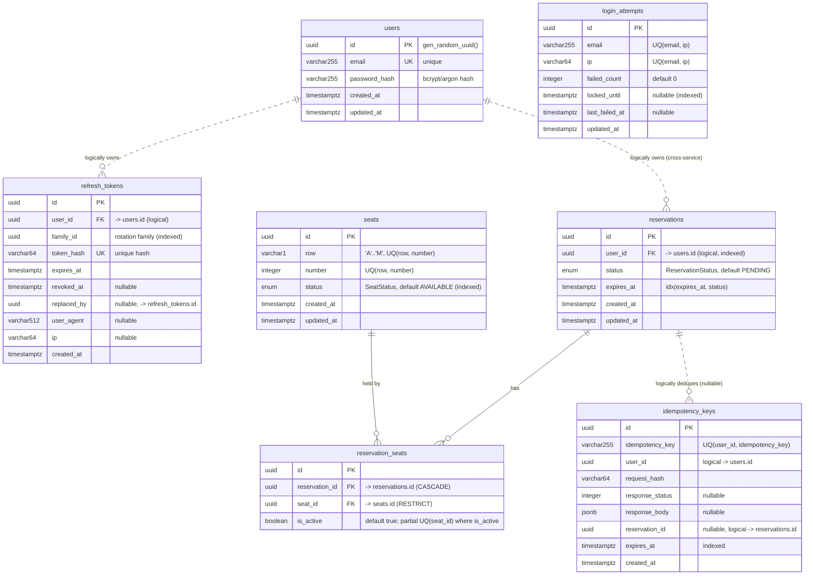
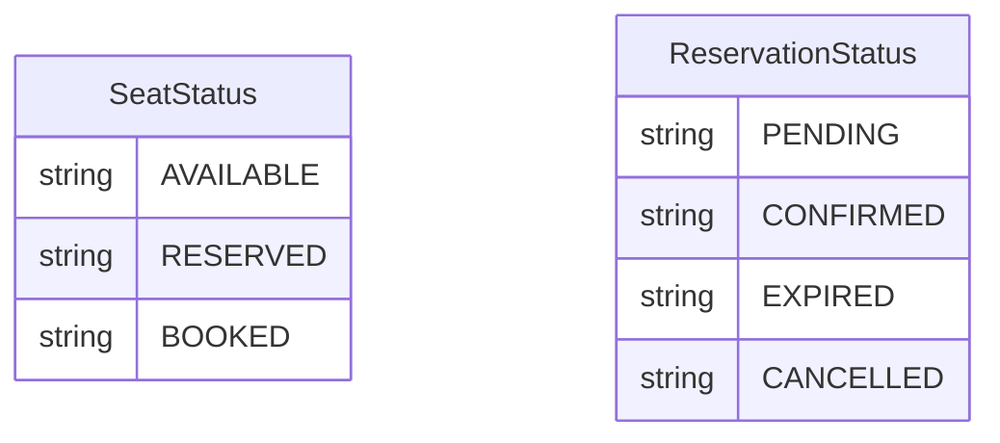

# Entity Relationship Diagram (ERD)

> Derived from the TypeORM entities in `backend-services/*/src/domain/entities/`.
> Two PostgreSQL schemas, one per service. There are **no physical foreign keys across
> services** — `cinema` tables reference `identity.users` only logically (by `userId`),
> following the microservice data-ownership boundary.

---

## 1. Full diagram

> Legend: `||--o{` = enforced FK (one-to-many). `||..o{` = logical link, **no DB
> foreign key** (cross-service or soft reference). `PK` primary key · `UK`/`UQ` unique ·
> `FK` foreign key.

---

## 2. Schema boundaries

| Schema | Service | Tables |
|---|---|---|
| `identity` | `identity-service` | `users`, `refresh_tokens`, `login_attempts` |
| `cinema` | `cinema-service` | `seats`, `reservations`, `reservation_seats`, `idempotency_keys` |

Each service owns its schema and migrations independently. The `cinema` schema stores
`user_id` values that originate from `identity.users`, but enforces **no** cross-schema
foreign key — the identity is trusted from the validated JWT, keeping the services
decoupled and independently deployable.

---

## 3. Relationships in detail

### Physical (foreign keys, within `cinema`)

| From | To | Cardinality | On delete | Meaning |
|---|---|---|---|---|
| `reservation_seats.reservation_id` | `reservations.id` | many → one | `CASCADE` | deleting a reservation removes its seat-hold rows |
| `reservation_seats.seat_id` | `seats.id` | many → one | `RESTRICT` | a seat can't be deleted while referenced by a hold |

`reservations` ↔ `seats` is therefore a **many-to-many** resolved through the
`reservation_seats` join table.

### Logical (no DB FK)

| From | To | Notes |
|---|---|---|
| `refresh_tokens.user_id` | `users.id` | within `identity`; indexed, not declared as FK |
| `refresh_tokens.replaced_by` | `refresh_tokens.id` | self-reference for rotation chains |
| `reservations.user_id` | `users.id` | **cross-service** — trusted from JWT |
| `idempotency_keys.user_id` | `users.id` | **cross-service** |
| `idempotency_keys.reservation_id` | `reservations.id` | nullable; set once the reserved request succeeds |
| `login_attempts.email` | `users.email` | soft link by email, not id |

---

## 4. Key constraints & indexes

| Table | Constraint / Index | Purpose |
|---|---|---|
| `users` | `UNIQUE(email)` | one account per email |
| `refresh_tokens` | `UNIQUE(token_hash)` · idx `family_id` · idx `user_id` | token lookup & rotation-family revocation |
| `login_attempts` | `UNIQUE(email, ip)` · idx `locked_until` | per-identity lockout tracking |
| `seats` | `UNIQUE(row, number)` · idx `status` | one physical seat per coordinate |
| `reservations` | idx `user_id` · idx `(expires_at, status)` | user history + expiry sweep |
| `reservation_seats` | **partial** `UNIQUE(seat_id) WHERE is_active = true` · idx `reservation_id` · idx `seat_id` | **anti-double-booking backstop** — at most one active holder per seat |
| `idempotency_keys` | `UNIQUE(user_id, idempotency_key)` · idx `expires_at` | request dedupe + TTL cleanup |

The partial unique index on `reservation_seats` is the database-level guarantee that a
seat can have only one active reservation at a time (DATABASE-DESIGN §4.4, DECISIONS
ADR-9).

---

## 5. Enums

Both enums are defined once in `@cinema/internal-sdk` and re-exported by each service and
the frontend (single source of truth — DECISIONS ADR-8).
