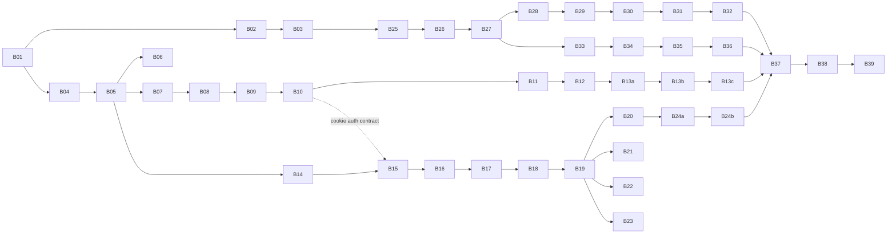

# Cinema Reservation System — Implementation Roadmap

**Mission ID**: CINEMA-001
**Purpose**: A staged, dependency-ordered plan to build the system. **Each stage is its own branch**, kept as small as possible — **≤ 10 changed files per branch** — so every PR is fast to review.

---

## 1. Conventions

| Topic | Rule |
|---|---|
| Base branch | `main`. Every feature branch is cut from `main` and merged back via PR. |
| Branch naming | `chore/…`, `ci/…`, `feat/…`, `test/…`, `docs/…` (Conventional Commits style). |
| PR size limit | **≤ 10 files** changed. If a unit naturally exceeds 10, split it (see the split rule below). |
| Tests | Tests ship **in the same branch** as the code, **always** — even when that pushes the branch past 10 files. Untested code is not done. The 10-file limit is never a reason to defer tests. When the feature code itself exceeds 10 files, split by layer first (entity → service → controller), then keep tests with the layer they cover. |
| Definition of Done | Branch compiles (`tsc`), lints clean, its own tests pass, and it does **not** break previously-merged branches. |
| Commit footer | `Co-Authored-By: Claude Opus 4.8 <noreply@anthropic.com>` |
| Merge strategy | Always `--merge`. Never `--squash` or `--rebase`. |
| Tests pass before push | **All tests pass before every `git push`** — unit, integration, API, page, e2e. Never push a branch with failing tests. |
| CI green before merge | **Wait for CI to pass (green) before merging into `main`.** Never merge while CI is running or failing. |
| **Pre-implementation read** | **Before touching a single file**, read the design docs listed under **"Design docs"** for that branch. Do not read the entire `design-packages/` directory — read only what is listed. Implementation decisions must be derived from the spec, not assumed. |
| **Post-merge status update** | **Immediately after every merge into `main`**, update the branch's status in the §10 summary table from `🔄 IN PROGRESS` → `✅ MERGED`. Never leave the table stale. |

**Split rule**: when a logical unit > 10 files, split by layer (entity/model/dao → service/controller → tests) or by sub-feature (access-token → refresh-token → csrf/lockout).

### 1.1 Testing & component conventions (apply to every branch)

- **Tests are non-negotiable**: every branch must include tests for the code it ships. There are no "we'll add tests later" branches.
- **Backend coverage** (per [TEST-STRATEGY.md](TEST-STRATEGY.md) §2a): every **endpoint** ships an API test (happy path + each documented error), and every **DAO** ships an integration test against the real DB. Service/domain logic is unit-tested.
- **Frontend coverage**: every **component** has a co-located unit test; every **view** also has a Playwright **page test with mocked responses**; every store/service/hook has a co-located `.spec`.
- **Component-folder + barrel** (per [FRONTEND-DESIGN.md](FRONTEND-DESIGN.md) §1.1): each component is its own folder — `index.ts` (barrel) + `<Name>.tsx` + `<Name>.spec.tsx` (views add `<Name>.page.spec.tsx`). Consumers import the folder, never the file. One component folder ≈ 3 files, which is why the frontend branches below are chunked 2–3 components at a time.

### 1.2 Agent legend

Each branch lists the agents that should be invoked for that task. Load only the agents listed — they carry the skills and context relevant to that layer. Always refer to an agent by its **full name** (no codes/abbreviations).

| Agent | When to invoke |
|---|---|
| `backend-developer` | Implementing NestJS entities, services, controllers, modules |
| `frontend-developer` | Implementing React components, hooks, stores, services |
| `backend-qa-tester` | Writing/running unit, integration, or API tests for backend |
| `frontend-qa-tester` | Writing/running Vitest unit tests or Playwright page tests |
| `backend-code-standards-reviewer` | Reviewing any backend code before PR is opened |
| `frontend-code-standards-reviewer` | Reviewing any frontend code before PR is opened |

---

## 2. Milestones overview

| # | Milestone | Branches | Outcome |
|---|---|---|---|
| M0 | Foundation & tooling | B01–B03 | Monorepo + linting + CI skeleton |
| M1 | Shared SDK | B04–B06 | `@cinema/internal-sdk` published to the workspace |
| M2 | identity-service | B07–B13c | Auth (cookie + refresh) fully working |
| M3 | cinema-service | B14–B24b | Seats, reservations, realtime, expiry |
| M4 | Frontend (cinema-app) | B25–B36 | React SPA end-to-end |
| M5 | Integration & infra | B37–B39 | `docker compose up` runs the whole stack |

> **Parallelization**: M4 (frontend) can start once `API-CONTRACT.md` is frozen — it only needs the contract, not the running backend (it mocks HTTP/socket in tests). M2 and the SDK observability branch (B06) can also overlap.

---

## 3. M0 — Foundation & tooling

### B01 · `chore/monorepo-foundation`
**Design docs**: `ARCHITECTURE.md`, `DECISIONS.md`, `INFRASTRUCTURE.md`
**Agents**: `backend-developer`, `backend-code-standards-reviewer`

Set up the npm-workspaces monorepo shell.
- `package.json` (workspaces: `backend-services/*`, `backend-services/libs/core/*`, `frontend-application/*`)
- `tsconfig.base.json`
- `.gitignore`
- `.nvmrc` (Node 20)
- `.env.example`
- `README.md` (skeleton; full version in B35)

**Done when**: `npm install` resolves the empty workspace tree.

### B02 · `chore/tooling-quality`
**Design docs**: `DECISIONS.md` (ADR-14)
**Agents**: `backend-developer`, `backend-code-standards-reviewer`

Lint/format/commit hooks (per ADR-14).
- `.eslintrc.cjs`
- `.prettierrc`, `.prettierignore`
- `commitlint.config.cjs`
- `.husky/pre-commit`, `.husky/commit-msg`
- `.lintstagedrc.json`

**Done when**: `npm run lint` and a test commit through husky both pass.

### B03 · `ci/github-actions`
**Design docs**: `DECISIONS.md` (ADR-12, ADR-14), `INFRASTRUCTURE.md`, `TEST-STRATEGY.md`
**Agents**: `backend-developer`, `backend-code-standards-reviewer`

CI pipeline + dependency scanning (ADR-14, ADR-12).
- `.github/workflows/ci.yml` (install → lint → typecheck → unit → integration[postgres service] → e2e → coverage gate → docker build)
- `.github/dependabot.yml`
- `.github/pull_request_template.md`

**Done when**: CI runs green on an empty repo (jobs no-op gracefully).

---

## 4. M1 — Shared SDK (`@cinema/internal-sdk`)

### B04 · `feat/sdk-core`
**Design docs**: `ARCHITECTURE.md`, `BACKEND-DESIGN.md`, `DECISIONS.md` (ADR-13)
**Agents**: `backend-developer`, `backend-code-standards-reviewer`

Infrastructure utilities.
- `backend-services/libs/core/sdk/package.json`, `tsconfig.json`
- `src/index.ts`
- `src/logger/logger.ts`
- `src/env/env-detector.ts`
- `src/exceptions/validation.exception.ts`
- `src/database-logger/database-logger.ts`

### B05 · `feat/sdk-types-clients`
**Design docs**: `BACKEND-DESIGN.md`, `DATABASE-DESIGN.md`, `API-CONTRACT.md`, `DECISIONS.md` (ADR-8)
**Agents**: `backend-developer`, `backend-code-standards-reviewer`

Shared domain types + identity client (ADR-8: no `CinemaClient`).
- `src/enums/seat-status.enum.ts`
- `src/enums/reservation-status.enum.ts`
- `src/types/user-profile.types.ts` (interface only)
- `src/types/seat.types.ts` (interface only; imports from enums/)
- `src/types/reservation.types.ts` (interface only; imports from enums/)
- `src/clients/identity.client.ts`
- `src/index.ts` (re-export)

### B06 · `feat/sdk-observability`
**Design docs**: `BACKEND-DESIGN.md`, `DECISIONS.md` (ADR-13), `TEST-STRATEGY.md`
**Agents**: `backend-developer`, `backend-qa-tester`, `backend-code-standards-reviewer`

Structured JSON logging + request-id context (ADR-13).
- `src/logger/request-context.ts` (AsyncLocalStorage store)
- `src/logger/logger.ts` (JSON output incl. `requestId`)
- `src/index.ts` (export context helpers)
- `tests/logger.spec.ts`

---

## 5. M2 — identity-service

### B07 · `feat/identity-scaffold`
**Design docs**: `BACKEND-DESIGN.md`, `DATABASE-DESIGN.md`, `SECURITY.md`, `DECISIONS.md` (ADR-4, ADR-5, ADR-6), `INFRASTRUCTURE.md`
**Agents**: `backend-developer`, `backend-code-standards-reviewer`

Service shell + config + bootstrap.
- `backend-services/identity-service/package.json`, `tsconfig.json`, `tsconfig.test.json`, `jest.config.js`, `Dockerfile`
- `src/main.ts` (helmet, CORS credentials, ValidationPipe, cookie-parser, `trust proxy`)
- `src/app.module.ts` (Zod env, TypeORM, Throttler)
- `src/infrastructure/config/app.config.ts` (+ `app-config.module.ts`)
- `src/infrastructure/config/typeorm.config.ts`

### B08 · `feat/identity-platform`
**Design docs**: `BACKEND-DESIGN.md`, `SECURITY.md`, `DECISIONS.md` (ADR-12, ADR-13), `TEST-STRATEGY.md`
**Agents**: `backend-developer`, `backend-code-standards-reviewer`

Cross-cutting platform pieces.
- `src/infrastructure/filters/http-exception.filter.ts`
- `src/infrastructure/interceptors/http-logging.interceptor.ts`
- `src/infrastructure/middleware/request-id.middleware.ts`
- `src/health/health.controller.ts`, `src/health/health.module.ts` (terminus + DB ping)
- `src/metrics/metrics.module.ts` (`/metrics`)

### B09 · `feat/identity-user-domain`
**Design docs**: `BACKEND-DESIGN.md`, `DATABASE-DESIGN.md`, `DECISIONS.md` (ADR-5, ADR-6), `API-CONTRACT.md`
**Agents**: `backend-developer`, `backend-code-standards-reviewer`

User building blocks (DDD layers).
- `src/domain/entities/user.entity.ts`
- `src/auth/domain-model/user.ts`
- `src/auth/dao/user.dao.ts`
- `src/auth/dto/register.dto.ts`, `login.dto.ts`, `user-profile.dto.ts`
- `src/auth/exception/duplicate-email.exception.ts`, `invalid-credentials.exception.ts`, `user-not-found.exception.ts`
- `src/auth/enum/auth-error-codes.enum.ts`

### B10 · `feat/identity-auth-access`
**Design docs**: `BACKEND-DESIGN.md`, `SECURITY.md`, `DECISIONS.md` (ADR-4), `API-CONTRACT.md`
**Agents**: `backend-developer`, `backend-code-standards-reviewer`

Access-token auth (register/login/me/validate) + cookies.
- `src/auth/service/auth.service.ts`
- `src/infrastructure/guards/jwt.strategy.ts` (cookie-first, Bearer fallback)
- `src/infrastructure/guards/jwt-auth.guard.ts`
- `src/auth/auth.controller.ts`
- `src/auth/auth.module.ts`
- `src/infrastructure/cookies/cookie.service.ts`

### B11 · `feat/identity-refresh-tokens`
**Design docs**: `BACKEND-DESIGN.md`, `DATABASE-DESIGN.md`, `SECURITY.md`, `DECISIONS.md` (ADR-4), `API-CONTRACT.md`
**Agents**: `backend-developer`, `backend-code-standards-reviewer`

Rotating refresh tokens + reuse detection + logout (ADR-4).
- `src/domain/entities/refresh-token.entity.ts`
- `src/auth/domain-model/refresh-token.ts`
- `src/auth/dao/refresh-token.dao.ts`
- `src/auth/service/auth.service.ts` (refresh/logout/rotation — edit)
- `src/auth/auth.controller.ts` (`/refresh`, `/logout` — edit)

### B12 · `feat/identity-csrf-lockout`
**Design docs**: `SECURITY.md`, `BACKEND-DESIGN.md`, `DATABASE-DESIGN.md`, `DECISIONS.md` (ADR-12)
**Agents**: `backend-developer`, `backend-code-standards-reviewer`

CSRF + brute-force lockout + CSP (ADR-12).
- `src/infrastructure/security/csrf.middleware.ts`
- `src/domain/entities/login-attempt.entity.ts`
- `src/auth/dao/login-attempt.dao.ts`
- `src/auth/service/auth.service.ts` (lockout — edit)
- `src/main.ts` (helmet CSP — edit)

### B13a · `test/identity-unit`
**Design docs**: `TEST-STRATEGY.md`, `BACKEND-DESIGN.md`, `SECURITY.md`
**Agents**: `backend-qa-tester`, `backend-code-standards-reviewer`

- `tests/unit/auth.service.spec.ts`, `user.model.spec.ts`, `refresh-token.model.spec.ts`, `csrf.middleware.spec.ts`

### B13b · `test/identity-integration` (one spec per DAO)
**Design docs**: `TEST-STRATEGY.md`, `DATABASE-DESIGN.md`, `BACKEND-DESIGN.md`
**Agents**: `backend-qa-tester`, `backend-code-standards-reviewer`

- `tests/integration/user.dao.spec.ts`, `refresh-token.dao.spec.ts`, `login-attempt.dao.spec.ts`
- `tests/integration/helpers/db.helper.ts`

### B13c · `test/identity-api` (every endpoint)
**Design docs**: `TEST-STRATEGY.md`, `API-CONTRACT.md`, `SECURITY.md`
**Agents**: `backend-qa-tester`, `backend-code-standards-reviewer`

- `tests/api/auth.controller.spec.ts` (register, login, refresh **rotation+reuse**, logout, me, validate — happy + all errors + lockout)
- `tests/api/health.controller.spec.ts`
- `tests/api/helpers/db.helper.ts`

---

## 6. M3 — cinema-service

### B14 · `feat/cinema-scaffold`
**Design docs**: `BACKEND-DESIGN.md`, `DATABASE-DESIGN.md`, `DECISIONS.md` (ADR-5, ADR-6), `INFRASTRUCTURE.md`
**Agents**: `backend-developer`, `backend-code-standards-reviewer`

Service shell (mirror of B07).
- `package.json`, `tsconfig.json`, `tsconfig.test.json`, `jest.config.js`, `Dockerfile`
- `src/main.ts`, `src/app.module.ts`
- `src/infrastructure/config/app.config.ts` (+ module), `typeorm.config.ts`

### B15 · `feat/cinema-platform`
**Design docs**: `BACKEND-DESIGN.md`, `SECURITY.md`, `DECISIONS.md` (ADR-4, ADR-12, ADR-13), `API-CONTRACT.md`
**Agents**: `backend-developer`, `backend-code-standards-reviewer`

Cross-cutting + remote auth (cookie-forwarding).
- `src/infrastructure/filters/http-exception.filter.ts`
- `src/infrastructure/interceptors/http-logging.interceptor.ts`
- `src/infrastructure/middleware/request-id.middleware.ts`
- `src/infrastructure/guards/remote-auth.guard.ts`
- `src/health/health.controller.ts`, `health.module.ts`
- `src/metrics/metrics.module.ts`

### B16 · `feat/cinema-seats`
**Design docs**: `BACKEND-DESIGN.md`, `DATABASE-DESIGN.md`, `API-CONTRACT.md`, `DECISIONS.md` (ADR-5, ADR-6)
**Agents**: `backend-developer`, `backend-code-standards-reviewer`

Seats domain end-to-end + seeder (115 seats).
- `src/domain/entities/seat.entity.ts`
- `src/seats/domain-model/seat.ts`
- `src/seats/dao/seat.dao.ts`
- `src/seats/dto/seat-response.dto.ts`
- `src/seats/enum/seat-status.enum.ts`
- `src/seats/exception/seat-not-found.exception.ts`
- `src/seed/seat-seeder.service.ts`
- `src/seats/service/seats.service.ts`
- `src/seats/seats.controller.ts`, `seats.module.ts`

### B17 · `feat/cinema-reservations-domain`
**Design docs**: `BACKEND-DESIGN.md`, `DATABASE-DESIGN.md`, `DECISIONS.md` (ADR-1, ADR-2, ADR-3, ADR-6)
**Agents**: `backend-developer`, `backend-code-standards-reviewer`

Reservation data shapes (no logic yet).
- `src/domain/entities/reservation.entity.ts`, `reservation-seat.entity.ts` (incl. `is_active`)
- `src/reservations/domain-model/reservation.ts` (constructor + state methods)
- `src/reservations/enum/reservation-status.enum.ts`
- `src/reservations/dto/create-reservation.dto.ts`, `reservation-response.dto.ts`

### B18 · `feat/cinema-seat-rules`
**Design docs**: `BACKEND-DESIGN.md`, `DECISIONS.md` (ADR-3), `TEST-STRATEGY.md`
**Agents**: `backend-developer`, `backend-qa-tester`, `backend-code-standards-reviewer`

The core business logic (Rule 1 + Rule 2 boundary-only, ADR-3).
- `src/reservations/validation/seat-selection.validator.ts`
- `src/reservations/exception/` ×6: `seats-unavailable`, `seats-not-consecutive`, `isolated-seat`, `reservation-not-found`, `reservation-not-owned`, `active-reservation-exists`
- `tests/unit/seat-selection.validator.spec.ts` (all PDF examples + unrelated-gap false-positive case)

### B19 · `feat/cinema-reservations-core`
**Design docs**: `BACKEND-DESIGN.md`, `DATABASE-DESIGN.md`, `DECISIONS.md` (ADR-1, ADR-2, ADR-6), `API-CONTRACT.md`
**Agents**: `backend-developer`, `backend-code-standards-reviewer`

Atomic reserve/confirm/cancel (SELECT FOR UPDATE, one-per-user, ADR-1/2/6).
- `src/reservations/dao/reservation.dao.ts`, `reservation-seat.dao.ts`
- `src/seats/dao/seat.dao.ts` (`lockForUpdate`, `deactivateSeats` — edit)
- `src/reservations/service/reservations.service.ts`
- `src/reservations/reservations.controller.ts`, `reservations.module.ts`

### B20 · `feat/cinema-realtime`
**Design docs**: `BACKEND-DESIGN.md`, `SECURITY.md`, `DECISIONS.md` (ADR-9), `API-CONTRACT.md`
**Agents**: `backend-developer`, `backend-code-standards-reviewer`

Socket.io gateway with cookie handshake auth.
- `src/gateway/seat.gateway.ts`
- `src/gateway/ws-auth.middleware.ts`
- `src/gateway/gateway.module.ts`

### B21 · `feat/cinema-expiry-cron`
**Design docs**: `BACKEND-DESIGN.md`, `DATABASE-DESIGN.md`, `DECISIONS.md` (ADR-7, ADR-10)
**Agents**: `backend-developer`, `backend-code-standards-reviewer`

Distributed-safe expiry (ADR-7/10).
- `src/scheduler/reservation-expiry.cron.ts` (`pg_try_advisory_lock`)
- `src/scheduler/scheduler.module.ts`

### B22 · `feat/cinema-idempotency`
**Design docs**: `BACKEND-DESIGN.md`, `DATABASE-DESIGN.md`, `DECISIONS.md` (ADR-11), `API-CONTRACT.md`
**Agents**: `backend-developer`, `backend-code-standards-reviewer`

Idempotency-Key on reserve (ADR-11).
- `src/domain/entities/idempotency-key.entity.ts`
- `src/reservations/idempotency/idempotency.dao.ts`
- `src/reservations/idempotency/idempotency.interceptor.ts`

### B23 · `test/cinema-unit`
**Design docs**: `TEST-STRATEGY.md`, `BACKEND-DESIGN.md`
**Agents**: `backend-qa-tester`, `backend-code-standards-reviewer`

- `tests/unit/reservations.service.spec.ts`, `reservation.model.spec.ts`, `reservation-expiry.cron.spec.ts`, `seat-seeder.spec.ts`
- (`seat-selection.validator.spec.ts` already shipped in B18)

### B24a · `test/cinema-integration` (one spec per DAO)
**Design docs**: `TEST-STRATEGY.md`, `DATABASE-DESIGN.md`, `BACKEND-DESIGN.md`
**Agents**: `backend-qa-tester`, `backend-code-standards-reviewer`

- `tests/integration/seat.dao.spec.ts`, `reservation.dao.spec.ts`, `reservation-seat.dao.spec.ts` (partial-unique-index constraint), `idempotency.dao.spec.ts`
- `tests/integration/helpers/db.helper.ts`

### B24b · `test/cinema-api` (every endpoint + concurrency)
**Design docs**: `TEST-STRATEGY.md`, `API-CONTRACT.md`, `DECISIONS.md` (ADR-1, ADR-2, ADR-11)
**Agents**: `backend-qa-tester`, `backend-code-standards-reviewer`

- `tests/api/seats.controller.spec.ts`, `reservations.controller.spec.ts` (all errors), `health.controller.spec.ts`
- `tests/api/reservation-concurrency.spec.ts` (N parallel → exactly one 201), `reservation-idempotency.spec.ts`
- `tests/api/helpers/db.helper.ts`

---

## 7. M4 — Frontend (cinema-app)

> Can begin in parallel after `API-CONTRACT.md` is frozen. **Tests are co-located** (component-folder convention §1.1) so each branch ships its own specs — there is no separate "frontend test" branch. Components are chunked 2–3 folders per branch to stay ≤ 10 files.

### B25 · `feat/web-scaffold` — (10)
**Design docs**: `FRONTEND-DESIGN.md`, `ARCHITECTURE.md`, `INFRASTRUCTURE.md`
**Agents**: `frontend-developer`, `frontend-code-standards-reviewer`

- `package.json`, `vite.config.ts`, `tsconfig.json`, `index.html`
- `src/main.tsx`, `src/App.tsx`
- `vitest.config.ts`, `playwright.config.ts`
- `Dockerfile`, `nginx.spa.conf`

### B26 · `feat/web-foundation` — (9)
**Design docs**: `FRONTEND-DESIGN.md`, `DECISIONS.md`
**Agents**: `frontend-developer`, `frontend-code-standards-reviewer`

Styling conventions + i18n + config + test harness.
- `src/styles/_variables.scss` (`$spacing-s/m/l/xl`), `_mixins.scss` (`flx($justify,$align,$text-align)`), `global.scss`
- `src/locales/en.ts`, `he.ts`
- `src/core/config/app.config.ts`, `src/core/types/api-error.ts`
- `src/test/setup.ts`, `src/test/factories.ts`

### B27 · `feat/web-http-core` — (6)
**Design docs**: `FRONTEND-DESIGN.md`, `API-CONTRACT.md`, `SECURITY.md`, `DECISIONS.md` (ADR-4)
**Agents**: `frontend-developer`, `frontend-qa-tester`, `frontend-code-standards-reviewer`

HTTP layer + shared hooks (each with co-located spec).
- `src/core/services/BaseHttpService.ts` + `.spec.ts` (`withCredentials`, 401→single refresh+retry, `X-CSRF-Token`)
- `src/shared/hooks/useStorage.ts` + `.spec.ts`
- `src/shared/hooks/useToast.ts` + `.spec.ts`

### B28 · `feat/web-auth-state` — (7)
**Design docs**: `FRONTEND-DESIGN.md`, `API-CONTRACT.md`, `SECURITY.md`
**Agents**: `frontend-developer`, `frontend-qa-tester`, `frontend-code-standards-reviewer`

- `src/features/auth/services/AuthService.ts` + `.spec.ts`
- `src/features/auth/stores/useAuthStore.ts` (derive from `/me`) + `.spec.ts`
- `src/features/auth/hooks/useAuth.ts` + `.spec.ts`
- `src/features/auth/types/index.ts`

### B29 · `feat/web-shared-ui` — (9)
**Design docs**: `FRONTEND-DESIGN.md`
**Agents**: `frontend-developer`, `frontend-qa-tester`, `frontend-code-standards-reviewer`

Shared component folders (barrel + component + unit spec each).
- `src/shared/components/Button/{index.ts, Button.tsx, Button.spec.tsx}`
- `src/shared/components/Input/{…}`
- `src/shared/components/Toast/{…}`

### B30 · `feat/web-routing-layouts` — (10)
**Design docs**: `FRONTEND-DESIGN.md`, `API-CONTRACT.md`
**Agents**: `frontend-developer`, `frontend-qa-tester`, `frontend-code-standards-reviewer`

- `src/core/router/index.tsx`
- `src/core/router/guards/RequireAuth/{index.ts, RequireAuth.tsx, RequireAuth.spec.tsx}`
- `src/shared/layouts/AuthLayout/{index.ts, AuthLayout.tsx, AuthLayout.spec.tsx}`
- `src/shared/layouts/AppLayout/{index.ts, AppLayout.tsx, AppLayout.spec.tsx}`

### B31 · `feat/web-auth-forms` — (6)
**Design docs**: `FRONTEND-DESIGN.md`, `API-CONTRACT.md`
**Agents**: `frontend-developer`, `frontend-qa-tester`, `frontend-code-standards-reviewer`

- `src/features/auth/components/LoginForm/{index.ts, LoginForm.tsx, LoginForm.spec.tsx}`
- `src/features/auth/components/RegisterForm/{index.ts, RegisterForm.tsx, RegisterForm.spec.tsx}`

### B32 · `feat/web-auth-views` — (8)
**Design docs**: `FRONTEND-DESIGN.md`, `API-CONTRACT.md`, `TEST-STRATEGY.md`
**Agents**: `frontend-developer`, `frontend-qa-tester`, `frontend-code-standards-reviewer`

Views with unit **and** page tests (mocked responses).
- `src/features/auth/views/LoginView/{index.ts, LoginView.tsx, LoginView.spec.tsx, LoginView.page.spec.tsx}`
- `src/features/auth/views/RegisterView/{index.ts, RegisterView.tsx, RegisterView.spec.tsx, RegisterView.page.spec.tsx}`

### B33 · `feat/web-cinema-services-stores` — (9)
**Design docs**: `FRONTEND-DESIGN.md`, `API-CONTRACT.md`
**Agents**: `frontend-developer`, `frontend-qa-tester`, `frontend-code-standards-reviewer`

- `src/features/cinema/services/CinemaService.ts` + `.spec.ts`, `ReservationService.ts` + `.spec.ts`
- `src/features/cinema/stores/useCinemaStore.ts` + `.spec.ts`, `useReservationStore.ts` + `.spec.ts`
- `src/features/cinema/types/index.ts`

### B34 · `feat/web-cinema-hooks` — (6)
**Design docs**: `FRONTEND-DESIGN.md`, `API-CONTRACT.md`, `BACKEND-DESIGN.md`
**Agents**: `frontend-developer`, `frontend-qa-tester`, `frontend-code-standards-reviewer`

- `src/features/cinema/hooks/useSeats.ts` + `.spec.ts`
- `src/features/cinema/hooks/useReservation.ts` + `.spec.ts`
- `src/features/cinema/hooks/useSocket.ts` + `.spec.ts` (withCredentials + reconnect re-fetch)

### B35 · `feat/web-cinema-seat-components` — (9)
**Design docs**: `FRONTEND-DESIGN.md`, `API-CONTRACT.md`
**Agents**: `frontend-developer`, `frontend-qa-tester`, `frontend-code-standards-reviewer`

- `…/components/SeatButton/{index.ts, SeatButton.tsx, SeatButton.spec.tsx}`
- `…/components/SeatGrid/{…}`
- `…/components/SeatingMap/{…}`

### B36 · `feat/web-cinema-view` — (7)
**Design docs**: `FRONTEND-DESIGN.md`, `API-CONTRACT.md`, `TEST-STRATEGY.md`
**Agents**: `frontend-developer`, `frontend-qa-tester`, `frontend-code-standards-reviewer`

- `…/components/ReservationPanel/{index.ts, ReservationPanel.tsx, ReservationPanel.spec.tsx}`
- `…/views/CinemaView/{index.ts, CinemaView.tsx, CinemaView.spec.tsx, CinemaView.page.spec.tsx}`

> Optional live smoke E2E (`tests/e2e/reservation-flow.spec.ts`) is added in **B39**.

---

## 8. M5 — Integration & infra

### B37 · `feat/infra-docker`
**Design docs**: `INFRASTRUCTURE.md`, `ARCHITECTURE.md`, `SECURITY.md`, `DECISIONS.md` (ADR-5, ADR-10), `BACKEND-DESIGN.md`
**Agents**: `backend-developer`, `backend-code-standards-reviewer`

One-command local run.
- `docker-compose.yml`, `docker-compose.override.yml`
- `nginx/nginx.conf`, `nginx/nginx.dev.conf`
- `scripts/init-schemas.sql` (schemas + `uuid-ossp` only — ADR-5)
- `.dockerignore`
- `.env.example` (final env — edit)

**Done when**: `docker compose up --build` serves the app at `http://localhost`.

### B38 · `feat/infra-scaling`
**Design docs**: `INFRASTRUCTURE.md`, `DECISIONS.md` (ADR-10), `BACKEND-DESIGN.md`
**Agents**: `backend-developer`, `backend-code-standards-reviewer`

Optional horizontal-scaling assets (ADR-10).
- `docker-compose.scale.yml` (optional `redis`, replicas)
- `src/gateway/gateway.module.ts` (Redis IO adapter wiring — edit)
- `scripts/load/reserve-contention.js` (k6 contention test)

### B39 · `docs/finalize` + live smoke
**Design docs**: `ARCHITECTURE.md`, `DECISIONS.md`, `TEST-STRATEGY.md`, `API-CONTRACT.md`
**Agents**: `backend-developer`, `backend-qa-tester`, `frontend-qa-tester`, `backend-code-standards-reviewer`

- `README.md` (full setup/run, CI, deliverables checklist — edit)
- `tests/e2e/reservation-flow.spec.ts` (optional live register → login → reserve → confirm)
- `DECISIONS.md` final pass; ERD export if a static image is desired

---

## 9. Sequencing & dependency graph

**Critical path**: B01 → B04 → B05 → B14 → B16 → B17 → B18 → B19 → B24a → B24b → B37.
Frontend (B25→B36) runs in parallel on its own track once the API contract is frozen.

---

## 10. Branch summary table

> **Legend**: `✅ MERGED` — merged into main | `🔄 IN PROGRESS` — branch open, awaiting review | `⏳ PENDING` — not yet started

| Branch | Files | Depends on | Agents | Status |
|---|---|---|---|---|
| B01 `chore/monorepo-foundation` | 6 | — | `backend-developer`, `backend-code-standards-reviewer` | ✅ MERGED |
| B02 `chore/tooling-quality` | 7 | B01 | `backend-developer`, `backend-code-standards-reviewer` | ✅ MERGED |
| B03 `ci/github-actions` | 3 | B01 | `backend-developer`, `backend-code-standards-reviewer` | ✅ MERGED |
| B04 `feat/sdk-core` | 8 | B01 | `backend-developer`, `backend-code-standards-reviewer` | ✅ MERGED |
| B05 `feat/sdk-types-clients` | 5 | B04 | `backend-developer`, `backend-code-standards-reviewer` | ✅ MERGED |
| B06 `feat/sdk-observability` | 4 | B04 | `backend-developer`, `backend-qa-tester`, `backend-code-standards-reviewer` | ✅ MERGED |
| B07 `feat/identity-scaffold` | 10 | B05 | `backend-developer`, `backend-code-standards-reviewer` | ✅ MERGED |
| B08 `feat/identity-platform` | 6 | B07 | `backend-developer`, `backend-code-standards-reviewer` | ✅ MERGED |
| B09 `feat/identity-user-domain` | 10 | B07 | `backend-developer`, `backend-code-standards-reviewer` | ✅ MERGED |
| B10 `feat/identity-auth-access` | 6 | B09 | `backend-developer`, `backend-code-standards-reviewer` | ✅ MERGED |
| B11 `feat/identity-refresh-tokens` | 5 | B10 | `backend-developer`, `backend-code-standards-reviewer` | ✅ MERGED |
| B12 `feat/identity-csrf-lockout` | 5 | B11 | `backend-developer`, `backend-code-standards-reviewer` | ✅ MERGED |
| B13a `test/identity-unit` | 4 | B12 | `backend-qa-tester`, `backend-code-standards-reviewer` | ✅ MERGED |
| B13b `test/identity-integration` | 4 | B13a | `backend-qa-tester`, `backend-code-standards-reviewer` | ✅ MERGED |
| B13c `test/identity-api` | 3 | B13b | `backend-qa-tester`, `backend-code-standards-reviewer` | ✅ MERGED |
| B14 `feat/cinema-scaffold` | 9 | B05 | `backend-developer`, `backend-code-standards-reviewer` | 🔄 IN PROGRESS |
| B15 `feat/cinema-platform` | 7 | B14 | `backend-developer`, `backend-code-standards-reviewer` | ✅ MERGED |
| B16 `feat/cinema-seats` | 10 | B15 | `backend-developer`, `backend-code-standards-reviewer` | ✅ MERGED |
| B17 `feat/cinema-reservations-domain` | 5 | B16 | `backend-developer`, `backend-code-standards-reviewer` | ✅ MERGED |
| B18 `feat/cinema-seat-rules` | 8 | B17 | `backend-developer`, `backend-qa-tester`, `backend-code-standards-reviewer` | ✅ MERGED |
| B19 `feat/cinema-reservations-core` | 6 | B18 | `backend-developer`, `backend-code-standards-reviewer` | ✅ MERGED |
| B20 `feat/cinema-realtime` | 3 | B19 | `backend-developer`, `backend-code-standards-reviewer` | 🔄 IN PROGRESS |
| B21 `feat/cinema-expiry-cron` | 2 | B19 | `backend-developer`, `backend-code-standards-reviewer` | ✅ MERGED |
| B22 `feat/cinema-idempotency` | 3 | B19 | `backend-developer`, `backend-code-standards-reviewer` | ✅ MERGED |
| B23 `test/cinema-unit` | 4 | B19 | `backend-qa-tester`, `backend-code-standards-reviewer` | ✅ MERGED |
| B24a `test/cinema-integration` | 5 | B22 | `backend-qa-tester`, `backend-code-standards-reviewer` | ✅ MERGED |
| B24b `test/cinema-api` | 6 | B24a | `backend-qa-tester`, `backend-code-standards-reviewer` | ✅ MERGED |
| B25 `feat/web-scaffold` | 10 | B03 | `frontend-developer`, `frontend-code-standards-reviewer` | ✅ MERGED |
| B26 `feat/web-foundation` | 9 | B25 | `frontend-developer`, `frontend-code-standards-reviewer` | ✅ MERGED |
| B27 `feat/web-http-core` | 6 | B26 | `frontend-developer`, `frontend-qa-tester`, `frontend-code-standards-reviewer` | ✅ MERGED |
| B28 `feat/web-auth-state` | 7 | B27 | `frontend-developer`, `frontend-qa-tester`, `frontend-code-standards-reviewer` | ✅ MERGED |
| B29 `feat/web-shared-ui` | 9 | B26 | `frontend-developer`, `frontend-qa-tester`, `frontend-code-standards-reviewer` | ✅ MERGED |
| B30 `feat/web-routing-layouts` | 10 | B28, B29 | `frontend-developer`, `frontend-qa-tester`, `frontend-code-standards-reviewer` | ✅ MERGED |
| B31 `feat/web-auth-forms` | 6 | B29 | `frontend-developer`, `frontend-qa-tester`, `frontend-code-standards-reviewer` | ✅ MERGED |
| B32 `feat/web-auth-views` | 8 | B30, B31 | `frontend-developer`, `frontend-qa-tester`, `frontend-code-standards-reviewer` | ✅ MERGED |
| B33 `feat/web-cinema-services-stores` | 9 | B27 | `frontend-developer`, `frontend-qa-tester`, `frontend-code-standards-reviewer` | ✅ MERGED |
| B34 `feat/web-cinema-hooks` | 6 | B33 | `frontend-developer`, `frontend-qa-tester`, `frontend-code-standards-reviewer` | ✅ MERGED |
| B35 `feat/web-cinema-seat-components` | 9 | B34 | `frontend-developer`, `frontend-qa-tester`, `frontend-code-standards-reviewer` | ✅ MERGED |
| B36 `feat/web-cinema-view` | 7 | B35 | `frontend-developer`, `frontend-qa-tester`, `frontend-code-standards-reviewer` | ⏳ PENDING |
| B37 `feat/infra-docker` | 7 | B13c, B24b, B36 | `backend-developer`, `backend-code-standards-reviewer` | ⏳ PENDING |
| B38 `feat/infra-scaling` | 3 | B37 | `backend-developer`, `backend-code-standards-reviewer` | ⏳ PENDING |
| B39 `docs/finalize` + live smoke | 3 | B38 | `backend-developer`, `backend-qa-tester`, `frontend-qa-tester`, `backend-code-standards-reviewer` | ⏳ PENDING |

**Total: 42 branches**, every one ≤ 10 files.
